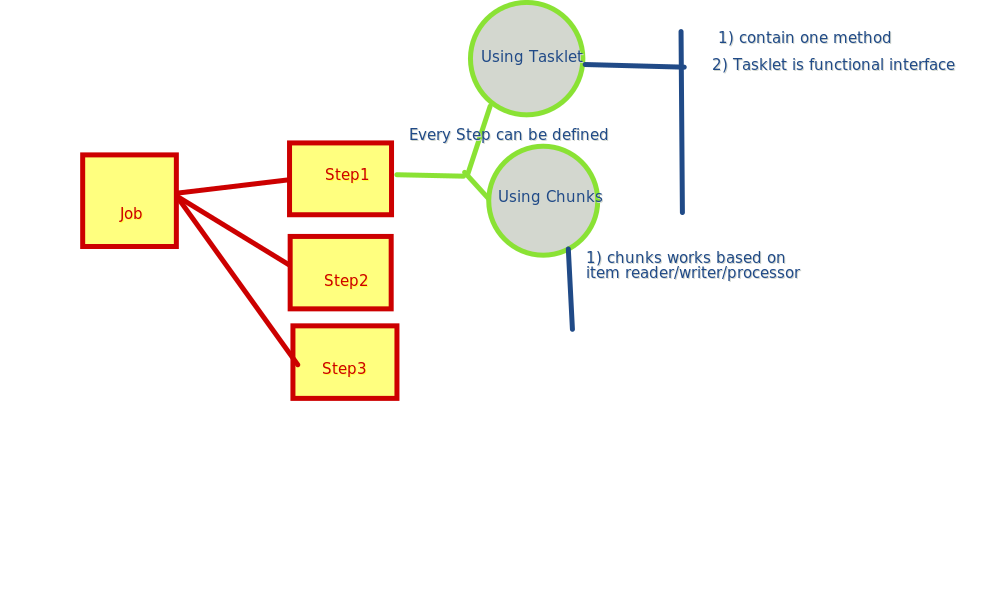

# Spring Batch
-------------------------
 
    Its for big background jobs. real time example is credit card bill every month 
    jobs run and generated bill.

Architecture:
---------------

##when to use chunk or tasklet

			1) if you want to complete whole task at once then tasklet will be good choice for you.
			 it recommended for small size of work.
			 2) if you want to complete whole task in peice of task (chunk) ,then good
			  choice will be chunk.it is recommended for big size of work.
			 Note: if chunk size is 10 then it means it will process 1 item reader 
			 next 1 item process till 10 
			 and then whole 10 items will forward to itemwriter for writing and completing the chunk. 
			 all chunks are independent to each others.

## How to run Batch Jobs
------------------------------
	Database configure.
	batch required database for storing metadata of jobs and steps.
	
	in spring boot , if you add h2 embedded database ,no need to declare the 
	the data-source properties in application.propperties.
	but to connect via /h2-console need datasource.url
	spring.datasource.url=jdbc:h2:mem:testdb
	it is auto configure by spring boot.
	but in this case embedded database is deleted once application is shutdown. 
	it will not keeping the metadata of previous execution.
	that why we must have to configure the external database.
	
	spring boot by-default execute all jobs once application getting started.
	if you want to execute the job based on scheduling time/event/rest-call 
	first you have configure
	spring.batch.job.enabled=false.
	now no jobs will be executed at application start time.
	after that using JobLauncher you can launch the job based on the requirement.

## Basic Concept:
-----------------------
			1) Every Job when runs it create unique job instance in database 
			(job-name+program-parameter).
			example:
           JobExecution jobExecution = launcher.run(job, parameters); //see LoadTriggerController.java
			2) same job can't be executed more than once if it is completed 
			in previous execution.
			3) if its fail in previous then it can run for complete the job .
			but when you run it second times 
			it will not execute the successful step of previous execution 
			it will start the execution from the step that was failed to completed.
			4) every ItemReader/Writer/Processor having many implementation based 
			on generic real time task.
			

## Avaliable endpoints
`http://localhost:8080` - home page  
`http://localhost:8080/load` - trigger load process. 
`http://localhost:8080/h2-console` - getting to H2 database. 

API DOCS
---------------
	   after architecture understanding lets us deep drive about important(base) api(interface or classes)
	 
	 1) Base interfaces of batch
	  -------------------------- 
	  Job,Step,ItemReader,ItemProcessor,ItemWriter,JobLauncher
   
     2) Base Classes:
     StepBuilderFactory,JobBuilderFactory ..etc
     
     Notes:
     1) by-default Springboot created bean for JobLauncher instance of SimpleJobLauncher and StepBuilderFactory,JobBuilderFactory
     2) using StepBuilderFactory we can create object of Step Interface
     3) using JobBuilderFactory we can create object of Job Interface
     4) using JobLauncher we can run job manually.
     5) ItemReader IMPL classes would be based on source data type, it is very importance 
     because item reader is going to decide how data will be fetch from source.
    
     example:
     public JdbcCursorItemReader<Student> reader() {
        JdbcCursorItemReader<Student> reader = new JdbcCursorItemReader<>();
        reader.setDataSource(dataSource); 
        reader.setSql("select id, roll_number, name from student");
        reader.setRowMapper(new StudentResultRowMapper());
        reader.setMaxRows(10); //setting max row fetching in one hit
        reader.setFetchSize(10); //
        reader.setQueryTimeout(10000);
        return reader;
    }
    
